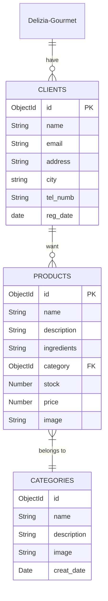

# Sistema de Gestión para Tiendas

## Delizia Gourmet

### Nombres y roles del grupo

- **Backend Developer**: Responsable del desarrollo del servidor y la conexión con la base de datos. Jose Daniel Soto Castro Backend Developer

- **Frontend Developer**: Encargado de la interfaz y la experiencia de usuario. Brayan Samboni Martínez

- **DB Manager**:  Diseña y administra la base de datos en MongoDB. Joaquín Emilio Quintero Carabali

-  **Líder del Proyecto**: Coordina las tareas y gestiona el repositorio en GitHub. Juan Camilo López Beltrán

  
### Descripción del sistema

Este es un  sistema de gestión para la tienda **Delizia Gourmet**, una empresa de entrega de comida, desarrollado utilizando la pila **MERN** (MongoDB, Express, React, Node.js) con la finalidad del control y administración de los clientes y productos por parte de los encargados de la tienda.

### Funcionalidades

- **Dashboard**: (Estadísticas básicas de la base de datos,  tales como número total de categoría, clientes y productos registrados. Filtros básicos de información.)

- **Gestión de Categoría**: Creación, edición, eliminación y listado de categorías

- **Gestión de Productos**: Creación, edición, eliminación y listado de productos

- **Gestión de Clientes**: Creación, edición, eliminación y listado de clientes

- **Diseño Responsive**: Interfaz amigable a dispositivos móviles y de escritorios

### Tecnologías Usadas

-  **Frontend**: Desarrollo en **React.js** con **TypeScript** y estilos con **Tailwind CSS** 

-  **Backend**: Desarrolló en **Node.js** con **Express**

-  **Base de datos**  **MongoDB** para almacenar información del proyecto. **Cloudinary** para almacenar las imágenes de las colecciones.

-  **Control de código**: Uso de **GitHub** para la gestión del proyecto

### Requisitos

-  [Node.js](https://nodejs.org/) - Entorno de ejecución de TypeScript

-  [MongoDB](https://www.mongodb.com/) - Base de datos NoSQL

  
## Diagrama de la base de datos

### Instalación y Configuración

  
1. Clona el repositorio:

```bash

git  clone  https://github.com/BeJotaTriple/Delizia-Gourmet.git

cd  Delizia-Gourmet
```

2. Instalar las dependencias necearías tanto en la carpeta del Backend y Frontend en el siguiente comando

```bash
npm  install
```

3. Crea un archivo .env tanto en la carpeta Backend y  Frontend añade las siguientes variables

  
=> Backend

```bash

PORT  =  <5000 o Puerto de preferencia>

MONGO_URI  =  mongodb://localhost:27017/Delizia-Gourmet <Base de Datos de Mongo Atlas>

```

=> Frontend

```bash

VITE_REACT_APP_API_URL= http://localhost:5000/ <Ruta del servidor Backend>

VITE_REACT_APP_CLOUD_NAME="ddjueeek6" <Cloud name de la cuenta en Cloudinary>

VITE_REACT_APP_UPLOAD_PRESET="img-DeliziaGourmet" <Preset de configuración para subir imágenes a Cloudinary>

```
## Ejecución

1. Inicia el servidor en la carpeta Backend:

```bash
cd backend
npm run build
npm run dev
```
2. Inicia la interfaz del proyecto en la carpeta Frontend:

```bash
cd frontend
npm run dev
```
**Opcional:** Desde la carpeta Backend puedes correr los siguientes comandos para correr los dos servicios al mismo tiempo

```bash
cd backend
npm run construction
npm run start
```
## Endpoints del Backend

Rutas para Clients

    POST /api/clients/ - <Crear un nuevo cliente.>

    GET /api/clients/ - <Obtener todos los clientes.>

    GET /api/clients/:id - <Obtener un cliente específico por su ID.>

    PUT /api/clients/:id - <Actualizar un cliente específico por su ID.>

    DELETE /api/clients/:id - <Eliminar un cliente específico por su ID.>

Rutas para Categories

    POST /api/categories/ - <Crear una nueva categoría.>

    GET /api/categories/ - <Obtener todas las categorías.>

    GET /api/categories/:id - <Obtener una categoría específica por su ID.>

    PUT /api/categories/:id - <Actualizar una categoría específica por su ID.>

    DELETE /api/categories/:id - <Eliminar una categoría específica por su ID.>

Rutas para Products

    POST /api/products/ - <Crear un nuevo producto.>

    GET /api/products/ - <Obtener todos los productos.>

    GET /api/products/:id - <Obtener un producto específico por su ID.>

    PUT /api/products/:id - <Actualizar un producto específico por su ID.>

    DELETE /api/products/:id - <Eliminar un producto específico por su ID.>

## Evidencias de Funcionamiento


**Nota:** las imágenes se encuentran con mayor resolución en la carpeta de evidencias.
